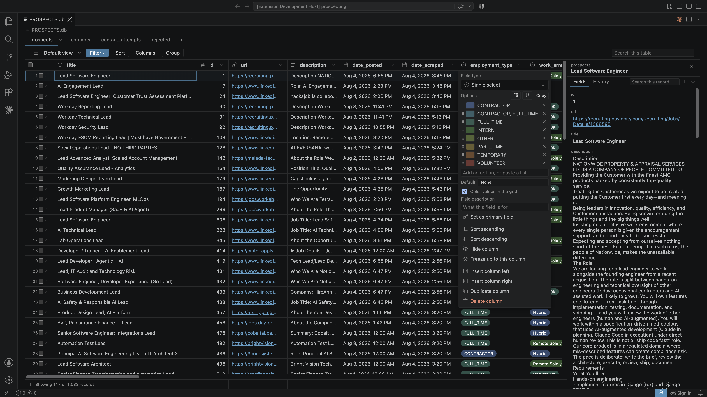

<p align="center">
  
</p>

<p align="center">
  Airtable-style grid, views, and linked records for local SQLite databases<br>
  A free VS Code / Cursor extension
</p>

<p align="center">
  <a href="#">VS Code Marketplace</a> · <a href="#">Open VSX (Cursor)</a> · <a href="https://airsqlite.com">Website</a>
</p>

---

<p align="center"></p>

Open any `.db`, `.sqlite`, or `.sqlite3` file and get a real data grid instead of a hex dump — inline editing, saved views, a nested filter builder, a detail panel with linked records derived from your foreign keys, and a live view of the file as something else writes to it.

No SQL, anywhere in the interface.

## About

Built by [Tyler Berggren](https://tylerberggren.com), Claude Code jockey and former Airtable consultant/power user.

I started using Airtable in 2020 to build the backend for my business. I got pretty good at it. I later became an Airtable consultant for Fortune 500 companies, building some pretty massive systems with Airtable as the foundation.

When Claude Code and vibecoding took off in 2025, I found myself using Airtable less and less (through no fault of its own). I started relying on local SQLite databases that could travel with my code projects, but missed the frontend I grew up with. I tried a handful of SQLite viewer extensions, but they couldn't hold a candle to Airtable.

When Airtable was acquired in 2026, it was high time I did something to honor my fallen friend. Instead of writing an in memoriam thinkpost with AI, I built a VS Code extension with AI — one that pays tribute to the beautiful data grid that I and so many others loved for years before AI ran its course.

I've enjoyed having a simple, tactile interface to work with data again, and I hope you do too.

## Install

Search **AirSQLite** in the extension panel, or from the command line:

```bash
# VS Code
code --install-extension AirSQLite.airsqlite

# Cursor
cursor --install-extension AirSQLite.airsqlite
```

Then open any `.db` file. The extension registers itself as the default editor for `.db`, `.sqlite`, and `.sqlite3`.

The SQLite binding ships as a prebuilt binary for all platform targets — no compile step, no Xcode command line tools.

## Field types

Every column has a display type that controls how it renders, edits, filters, and summarizes. You can set it explicitly from the column header menu, or leave it unset and let AirSQLite infer one from the data.

| Type | What it does |
|------|-------------|
| **Text** | Single-line plain text. The default when nothing else matches. |
| **Long text** | Multi-line text. Editor is a textarea; Enter inserts a newline, Cmd/Ctrl+Enter commits. Inferred when the longest value exceeds 120 characters or any value contains a newline. |
| **Number** | Numeric value, right-aligned. Configurable decimal places (Auto, 0–5) from the column header menu. Inferred for INTEGER, REAL, and NUMERIC columns (when not all-boolean). |
| **Currency** | Formatted as USD (`$1,234.56`). Show or hide cents from the column header menu. Never inferred — must be set manually. |
| **Percent** | Stores the raw fraction, displays ×100 with a `%` suffix (e.g. `0.42` → `42%`). Configurable decimal places (Auto, 0–5). Never inferred. |
| **Duration** | Stores total seconds, displays as `H:MM:SS` or `M:SS`. Never inferred. |
| **Rating** | Row of clickable stars (1–10, default 5). Click a star to set, click the last filled star to clear. Configurable max via the column header menu. Never inferred. |
| **Checkbox** | A checkbox that commits on click. Stores 0/1 in an INTEGER column. Inferred when every sampled value is 0 or 1. |
| **Toggle** | Identical to checkbox in behavior and storage, with a toggle switch visual instead. Never inferred. |
| **Single select** | A dropdown of configured choices, displayed as a colored chip. Choices and colors are configured from the column header menu. Never inferred. |
| **Multi-select** | Multiple tags stored as a JSON array in a TEXT column (e.g. `["red","blue"]`). Tags render as chips; the editor provides a tag input with autocomplete from configured choices. Inferred when every non-empty value parses as a JSON array. |
| **Date** | Formatted date, optionally with time. Options for `showTime` and `timezone` (11 presets including Local, UTC, ET, PT, etc.) are configurable per column. Inferred when every value matches an ISO date pattern. |
| **URL** | Clickable link. Cmd/Ctrl-click opens the URL; a copy button appears beside it. Inferred when every value matches `https://...`. |
| **Email** | `mailto:` link with copy button. Inferred when every value matches a standard email pattern. |
| **Phone** | `tel:` link with copy button. Inferred when every value matches a phone number pattern (7+ digits). |

### Inference

When a column has no stored display type, AirSQLite samples up to 200 rows and applies heuristics — every sampled value must agree for a type to be inferred. For example, one non-email in a column of emails drops it back to plain text. Inferred types are marked "— guessed" in the column header menu and are never written to the database. Setting a type explicitly always overrides inference.

### Computed fields

Computed fields are formula columns defined by a SQL expression. They're designed to be authored by your coding agent — describe the column you want and the agent writes the formula. The result is evaluated at query time, so it stays current as data changes. Computed fields are read-only in the grid and detail panel, filterable, sortable, and summarizable. The formula is visible from the column header menu.

### Column rename

Rename any column from its header menu. The rename cascades to all saved views — sort, filter, grouping, column order, widths, visibility, and summaries all update automatically.

### Linked records

Foreign key columns are automatically detected. Instead of showing a raw integer, the cell displays a clickable chip with the referenced record's primary field (typically a `name`, `title`, or `label` column). The detail panel shows reverse lookups — all records from other tables that reference the current row.

## Views

Views save a particular way of looking at a table — which columns are visible, their order and widths, how rows are sorted, filtered, and grouped, and what summary functions run along the bottom.

Every table starts with one default view. You can create new views from scratch, duplicate the current one, rename them, or set a default. Switching back to a view restores it exactly as you left it. The extension remembers which view you had open last per table.

### What a view stores

- **Column visibility** — hide columns you don't need; new columns added to the schema appear automatically
- **Column order** — drag to reorder; the primary field is always pinned leftmost
- **Column widths** — drag to resize, or double-click the resize handle to auto-fit to content
- **Frozen columns** — freeze columns on the left so they stay visible while scrolling horizontally; drag the freeze boundary to adjust
- **Sort** — one or more columns, each ascending or descending
- **Filters** — a nested AND/OR filter tree (see below)
- **Grouping** — one or more columns to group rows by (see below)
- **Summary functions** — per-column aggregates shown in the summary bar (sum, average, count, min, max, count empty, count not empty, percent empty)

Changes auto-save as you make them — there's no save button to forget.

## Filters

The filter builder supports nested AND/OR groups. Each condition picks a column, an operator, and a value. Groups can contain other groups, so you can express things like "status is Active AND (priority is High OR assigned to me)."

The conjunction (AND/OR) is set per group and applies to all conditions in that group. The operator list adapts to the column's field type:

| Field type | Operators |
|------------|-----------|
| Text, long text, URL, email, phone | contains, does not contain, is, is not, starts with, ends with, is empty, is not empty |
| Number, currency | =, ≠, >, ≥, <, ≤, between, is empty, is not empty |
| Date | is, is not, is after, is before, is empty, is not empty |
| Checkbox, toggle | is (checked/unchecked), is empty, is not empty |
| Single select, multi-select | is, is not, contains, is empty, is not empty |
| Linked records | is, is not, contains, is empty, is not empty |

Filters on linked record columns match against the referenced record's display name, not the raw foreign key value. For example, filtering a `customer_id` column with "contains Smith" matches records whose customer's name contains "Smith."

Filters are part of the saved view — they persist across sessions.

## Search

The search bar does a substring match across all visible columns. It is intentionally not full-text search — it's a simple `LIKE '%term%'` that finds any row containing the term in any visible column. Search also highlights matching column headers.

Search is transient and is not part of a saved view. It answers a question you have right now; a view is a way of looking that you return to.

## Grouping

Group rows by one or more columns. Check columns in the group menu, then drag to reorder — the top-to-bottom order determines nesting (first = outermost group). Each group header shows the value, row count, and inline summary aggregates matching your summary bar functions.

Each grouping column has an ascending/descending toggle, saved with the view. Groups are collapsible — click the chevron to collapse, or use "Collapse all" / "Expand all" in the group menu. Collapse state persists across reloads but is not saved with the view, since which groups happen to be open is a scroll position, not an arrangement.

Group headers format values by display type — checkboxes show "Checked" / "Unchecked", currencies and percents format as you'd expect, and dates use your date format.

Grouping columns sort ahead of your own sort order to keep each group as a contiguous block of rows.

## How it works

The backend is the only layer that touches SQLite or the filesystem. The UI is a standalone Preact app that talks to it over a request/response protocol. Nothing in the UI layer imports `vscode` — a build-time check enforces this.

**Configuration lives in the database, not in config files.** Four `_airsqlite_*` tables are created in your database on first open, storing field types, saved views, primary fields, and action buttons. Copy the `.db` to another machine and your views come along. If the file is read-only, none are created and the extension falls back to inference.

**The audit trail** appends one NDJSON line per write to a sidecar file next to your database, recording only the fields that changed. This powers the History tab and the `__created`/`__modified` virtual columns.

**Live reload** watches the database's directory (not the file — WAL mode writes to `-wal`) and uses `PRAGMA data_version` to distinguish external writes from your own. When an external write lands, changed cells flash, added rows highlight, and new columns appear automatically. If an external write lands on the cell you're editing, your draft survives with a badge showing the value that moved underneath.

## Actions

Action buttons are configured by writing a row to `_airsqlite_actions` — there's deliberately no GUI for this. You describe what you want to your coding agent, and it writes the row. `{{field}}` interpolation is strict: a missing column is an error, not a blank.

| Type | What it does |
|------|-------------|
| `webhook` | HTTP request from the extension (defaults to POSTing the row) |
| `url` | Opens in your browser |
| `script` | Runs in a shell, output captured, killed after 30s |
| `claude` | Opens a VS Code terminal and runs the Claude Code CLI with the interpolated prompt |
| `clipboard` | Copies the interpolated prompt to your clipboard |

Scripts and webhooks show a confirmation dialog first. Every time — there's no "trust this file" memory, because a file that says "trust me" can't be the thing granting the trust.

## Not included

- **SQL surface** — no query editor, no console
- **SQL VIEWs** — tables only
- **Remote / vscode.dev** — needs a real filesystem and a native module

## License

MIT
